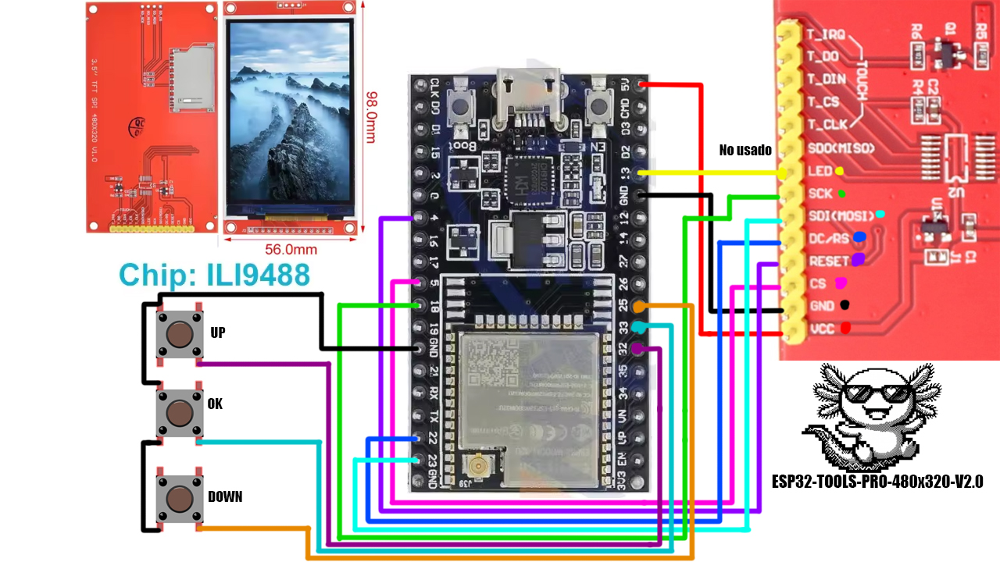
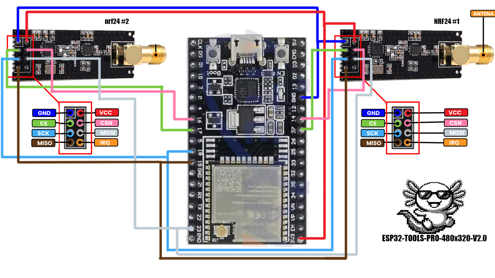
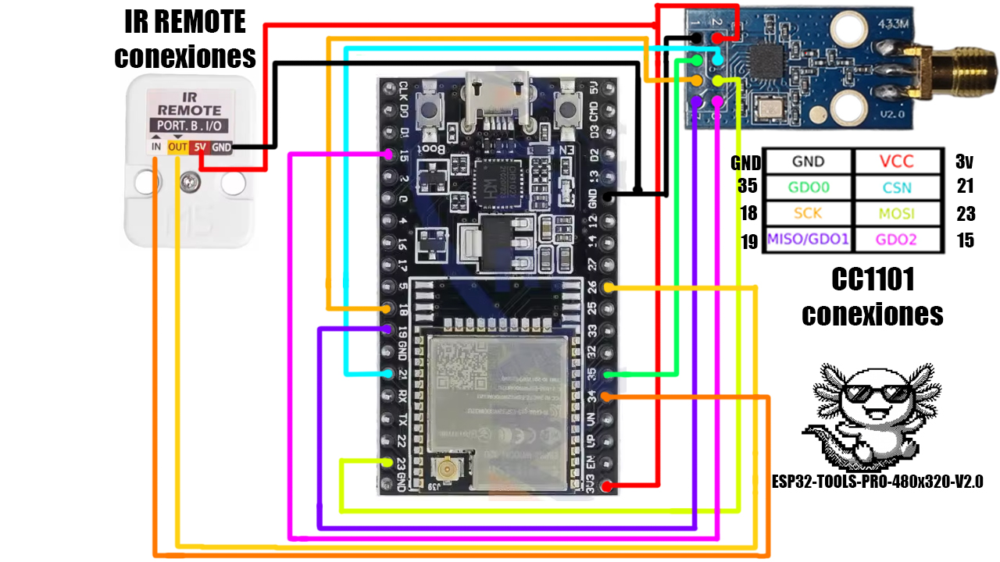
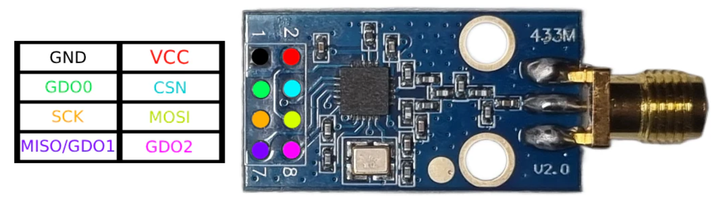
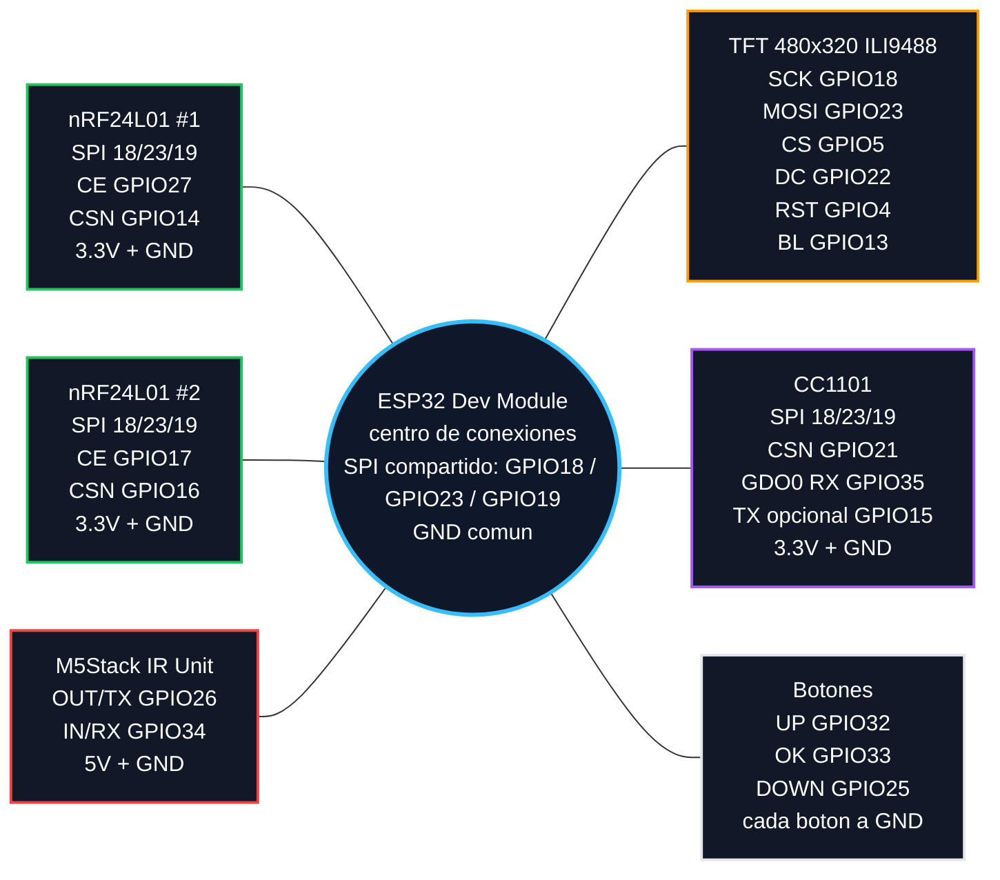

# ESP32-TOOLS-PRO-480x320-V2.0

Firmware multi-herramienta para ESP32 Dev Module con pantalla TFT SPI 480x320. Esta version V2.0 agrega soporte real para modulos externos IR y CC1101, nuevas herramientas WiFi/BLE, captura y replay IR guardable, analisis RF sub-GHz y una interfaz mas pulida para uso de laboratorio propio.

> Usa este firmware solo en tus redes, tus dispositivos y entornos donde tengas autorizacion. Varias funciones pueden escanear, transmitir, interferir o copiar senales. El objetivo de este proyecto es aprendizaje, diagnostico y laboratorio propio.

[](https://github.com/pepeangell5)
[](https://pepeangell5.github.io/ESP32-TOOLS-PRO-480x320-V2.0/)
[](https://instagram.com/pepeangelll)
[](https://www.facebook.com/esp32tools/)

## Que cambia frente a V1.0

- Soporte para M5Stack IR Unit con captura, replay, guardado de senales y controles virtuales.
- Soporte para modulo CC1101 sub-GHz dentro de `Radio Tools > CC1101`.
- `Jammer` renovado en `Radio Tools` para pruebas 2.4 GHz con doble nRF24L01.
- Nuevo `BT Jammer` dentro de `Bluetooth Tools` para barrido educativo 2.4 GHz en laboratorio propio.
- Nuevas herramientas WiFi: Channel Scan, WiFi Radar y WiFi Direction Finder.
- Nuevo BLE Device Radar con seguimiento de RSSI, cercania estimada y detalles limpios.
- Nuevo BLE Inspector para ver fabricante, tipo, appearance y servicios.
- iPhone Remote/BLE HID experimental para pruebas con dispositivos propios.
- Splash actualizado con animacion de texto mas limpia y marca `BWifiKill`.
- Menus con menos parpadeo, cursor recordado al volver y pantallas de diagnostico mas claras.
- Documentacion de pines para soldar el hardware adicional sin adivinar.

## Hardware objetivo

- ESP32 Dev Module clasico.
- Pantalla TFT SPI 480x320 con driver ILI9488.
- 2 modulos nRF24L01 para herramientas 2.4 GHz.
- M5Stack IR Unit con receptor y transmisor infrarrojo.
- Modulo CC1101 sub-GHz.
- 3 botones fisicos: UP, OK y DOWN.
- Cables, soldadura, headers y GND comun para todos los modulos.

Los modulos RF433T/RF433R no estan integrados en esta version porque el CC1101 cubre mejor el trabajo sub-GHz y permite mas diagnostico desde software.

## Galeria

| Vista | Imagen |
| --- | --- |
| Dispositivo terminado |  |
| Vista frontal |  |
| Vista lateral |  |
| Vista interna / montaje |  |

## Capturas del firmware

| Menu | Imagen |
| --- | --- |
| Splash |  |
| Menu principal |  |
| WiFi Tools |  |
| WiFi scanner / canales |  |
| Radio Tools |  |
| Bluetooth Tools |  |
| Packet Monitor |  |
| System Tools |  |
| Screensaver |  |

## Navegacion

- `UP`: subir o cambiar valor.
- `DOWN`: bajar o cambiar valor.
- `OK`: entrar, seleccionar, capturar o ejecutar accion.
- `OK` mantenido: regresar, cancelar o salir de la pantalla actual.
- Los submenus recuerdan la opcion donde estabas al regresar.

## Funciones principales

### WiFi Tools

- `WiFi Scanner`: escanea redes WiFi 2.4 GHz cercanas y muestra SSID, BSSID, canal, RSSI, frecuencia y seguridad.
- `Channel Scan`: agrupa redes por canal, muestra cuantas redes hay en cada canal y permite abrir la lista de APs por canal.
- `WiFi Radar`: permite elegir un AP y rastrearlo por RSSI, porcentaje de cercania, pico, tendencia e historial.
- `WiFi Direction Finder`: mide RSSI por sectores para estimar desde que direccion llega mas fuerte una red.
- `WiFi Config`: conecta el ESP32 a una red usando teclado virtual y guarda credenciales en NVS.
- `Beacon Spam`: emite beacons de prueba para laboratorio controlado.
- `Deauther`: herramienta de pruebas WiFi para entornos autorizados.
- `Evil Portal`: portal cautivo educativo para demostrar flujos de phishing en laboratorio propio.
- `Probe Sniffer`: observa probes WiFi cercanos y muestra actividad detectada.
- `KARMA Attack`: modo educativo para entender respuestas a probes y asociaciones inseguras.

Limitacion importante: el ESP32 clasico solo trabaja WiFi 2.4 GHz. No puede escanear redes 5 GHz.

### Radio Tools

- `Jammer`: modo renovado para pruebas 2.4 GHz en laboratorio propio. Permite elegir canal WiFi, activar/detener con `OK` y usa los dos nRF24L01 cuando estan disponibles.
- `Radio Scanner`: analizador visual 2.4 GHz con espectro, actividad por canal y vistas tipo waterfall.
- `Signal Tools`: herramientas IR y diagnostico basico de pines.
- `CC1101`: menu dedicado para sub-GHz con diagnostico, espectro, monitor, finder y analisis RF.

### Signal Tools / IR

- `Hardware Diag`: muestra pines, estado SPI, niveles RX y estado general del hardware.
- `Input Monitor`: muestra actividad en IR RX y GDO0 del CC1101 para validar cableado.
- `IR Raw Capture`: captura senales raw de controles infrarrojos.
- `IR Replay`: reproduce la ultima captura usando carrier IR de 38 kHz.
- `IR TX Test`: emite tres flashes IR para validar el transmisor con camara de celular.
- `Saved Captures`: guarda capturas IR con nombre, las carga, reproduce, renombra o borra.
- `IR Remotes`: crea controles virtuales con botones que apuntan a capturas guardadas.
- `IR Analyzer`: detector de actividad IR en vivo con estados `IDLE`, `FRAME`, `REPEAT` y `NOISE`.
- `Protocol Scan`: intenta clasificar la senal como NEC, Samsung, LG, Sony, Panasonic, RC5, RC6 o RAW.
- `IR Sniffer`: registra eventos IR en vivo con protocolo, codigo, bits, duracion y repeticiones.
- `Night IR`: detecta actividad IR pulsada/modulada de controles, LEDs IR, sensores o camaras con IR pulsado.
- `IR Proximity`: prueba experimental de rebote IR. No mide distancia real; depende mucho del montaje fisico.

Notas IR:

- Muchos minisplits/aires acondicionados usan codigos largos con estado completo. Subir temperatura, bajar temperatura, encender y apagar pueden ser capturas totalmente distintas.
- El receptor IR demodulado no mide intensidad analogica real ni frecuencia carrier exacta. Las barras son actividad detectada, no potencia optica precisa.
- Para capturas confiables, apunta el control directo al receptor y evita luz IR fuerte alrededor.

### CC1101 Tools

- `Hardware Diag`: verifica comunicacion SPI, `PARTNUM`, `VERSION`, `MARCSTATE`, RSSI, LQI y nivel GDO0.
- `Spectrum Scan`: barre bandas comunes 315, 433, 868 y 915 MHz para ver picos de RSSI.
- `Waterfall`: vista historica de actividad RF por frecuencia.
- `Frequency Mon`: monitorea una frecuencia fija como 315.00, 390.00, 433.92, 868.35 o 915.00 MHz.
- `Freq Finder`: calibra ruido y busca automaticamente el pico de una senal sub-GHz.
- `Brute Search`: busqueda amplia para encontrar actividad candidata.
- `Code Check`: compara varias pulsaciones para ver si una senal parece fija o cambiante.
- `RF Analyzer`: muestra pulsos, duracion total, promedios corto/largo, tipo OOK/ASK y firma/hash.
- `RF Raw View`: captura y dibuja la senal como barras/pulsos para comparar botones.
- `RF Live`: detector en vivo con frecuencia, RSSI pico, contador de eventos y ultima actividad.
- `Lab Replay`: replay RF OOK/ASK solo para dispositivos propios de codigo fijo y pruebas de laboratorio.
- `Test Beacon`: transmision corta de prueba para validar salida RF en un entorno controlado.

Notas CC1101:

- `433.92 MHz` y `434 MHz` normalmente se refieren a la misma zona practica. Muchos controles se anuncian como 434 aunque trabajen cerca de 433.92 MHz.
- El medidor de frecuencia es aproximado. No sustituye un analizador de espectro profesional.
- No uses replay RF en autos, portones, alarmas, cerraduras o sistemas ajenos. Muchos usan rolling code y no deben copiarse ni probarse fuera de laboratorio propio.

### Bluetooth Tools

- `BLE Device Radar`: escanea BLE, muestra nombre, MAC, RSSI, fabricante/tipo y permite rastrear un objetivo con historial.
- `BLE Inspector`: scanner mejorado con clasificacion por fabricante, appearance, tipo de dispositivo y servicios.
- `iPhone Remote`: modo BLE HID experimental para emparejamiento/control basico en dispositivos propios.
- `BLE Spam`: pruebas BLE educativas en laboratorio.
- `BT Disruptor`: pruebas Bluetooth de laboratorio controlado.
- `BT Jammer`: barrido 2.4 GHz con doble nRF24L01 para pruebas educativas de corto alcance en entorno propio.

### System Tools

- `Settings`: configuracion del dispositivo y opciones guardadas.
- `System Info`: informacion de memoria, firmware y estado del ESP32.
- `Clock & Weather`: reloj/clima con teclado virtual para configuracion.
- `Web Dashboard`: crea el AP `ESP32-TOOLS-PRO` con password `admin1234` y abre un panel web en `http://192.168.4.1`.
- `About`: informacion del proyecto.

### Web Dashboard

La fase 1 del dashboard web se activa desde `System > Web Dashboard`. Al entrar, el ESP32 levanta un AP propio:

```text
SSID: ESP32-TOOLS-PRO
PASS: admin1234
URL : http://192.168.4.1
```

Funciones disponibles en la fase 1:

- Dashboard general con uptime, heap libre, clientes conectados y pines principales.
- Diagnostico rapido de niveles IR RX y CC1101 GDO0.
- Lista de capturas IR guardadas con replay, rename y delete.
- Monitor CC1101 por frecuencia preset: 315.00, 390.00, 433.92, 868.35 y 915.00 MHz.
- WiFi Tools desde navegador:
  - `WiFi Scanner`: lista de redes, canal, RSSI, seguridad y BSSID.
  - `Channel Scan`: resumen por canal y tabla de redes 2.4 GHz.
  - `WiFi Radar`: selecciona un AP y lo rastrea por RSSI/cercania.
  - `Direction Finder`: mide frente, derecha, atras e izquierda para sugerir la direccion mas fuerte.
  - `Beacon Spam`: demo web controlada con SSIDs de laboratorio, canal fijo del dashboard, boton start/stop y auto-stop.
  - `Deauther`, `Evil Portal`, `Probe Sniffer` y `KARMA Attack` aparecen como `LOCAL ONLY` para usarse desde la pantalla del dispositivo.

El dashboard no ejecuta funciones que toman control completo del WiFi como Deauther, Evil Portal, KARMA o jamming. Es intencional para evitar conflictos con el AP del dashboard y mantenerlo estable.

## Componentes usados

| Componente | Descripcion | Voltaje recomendado | Notas |
| --- | --- | --- | --- |
| ESP32 Dev Module | Microcontrolador principal del proyecto | USB/5V en placa | Logica GPIO de 3.3V |
| TFT 480x320 ILI9488 SPI | Pantalla principal | Segun modulo, comunmente 5V o 3.3V | Senales SPI a 3.3V |
| nRF24L01 #1 | Radio 2.4 GHz principal | 3.3V | No alimentar a 5V |
| nRF24L01 #2 | Radio 2.4 GHz secundario | 3.3V | Recomendado capacitor cerca de VCC/GND |
| M5Stack IR Unit | Receptor + transmisor infrarrojo | 5V | Cableado verificado con OUT en GPIO26 e IN en GPIO34 |
| CC1101 | Radio sub-GHz para 315/433/868/915 MHz | 3.3V | No alimentar a 5V |
| Botones UP/OK/DOWN | Navegacion del firmware | GPIO a GND | Usa `INPUT_PULLUP` interno |

### Imagenes de componentes

| Componente | Imagen |
| --- | --- |
| ESP32 Dev Module |  |
| Pantalla ILI9488 480x320 |  |
| Modulos nRF24L01 |  |
| nRF24L01 |  |
| CC1101 |  |
| Antena |  |
| M5Stack IR Unit |  |
| IR Unit vista 2 |  |
| Botones |  |
| Bateria |  |
| TP4056 |  |
| Step-up |  |
| Interruptor |  |
| Placa PCB / montaje |  |

### Diagramas de conexiones completas

Estos diagramas muestran el cableado por bloques para que sea mas facil soldar y revisar el montaje sin saturar una sola imagen.

#### Pantalla TFT y botones



#### Modulos nRF24L01



#### CC1101 e IR Remote



### Pinouts de referencia

| Modulo | Pinout |
| --- | --- |
| nRF24L01 PA + LNA |  |
| CC1101 |  |

## Tabla de conexiones

Todos los modulos deben compartir `GND` con el ESP32. No conectes ningun modulo de 3.3V a 5V.

### Bus SPI compartido

| Senal | ESP32 GPIO | Usado por |
| --- | ---: | --- |
| SCK | GPIO18 | TFT, nRF24 #1, nRF24 #2, CC1101 |
| MOSI | GPIO23 | TFT, nRF24 #1, nRF24 #2, CC1101 |
| MISO | GPIO19 | nRF24 #1, nRF24 #2, CC1101 |

Cada modulo SPI tiene su propio pin `CS/CSN`, por eso pueden compartir SCK/MOSI/MISO.

### Pantalla TFT 480x320

| Pin TFT | ESP32 GPIO | Nota |
| --- | ---: | --- |
| CS | GPIO5 | Chip select TFT |
| RST | GPIO4 | Reset TFT |
| DC / RS | GPIO22 | Data/Command |
| LED / BL | GPIO13 | Backlight |
| SCK / CLK | GPIO18 | SPI compartido |
| MOSI / SDI | GPIO23 | SPI compartido |
| MISO / SDO | No usado por TFT | El firmware define TFT MISO como `-1` |
| VCC | Segun modulo | Revisa tu pantalla: algunas aceptan 5V, otras 3.3V |
| GND | GND | Tierra comun |

### nRF24L01 #1

| Pin nRF24 | ESP32 GPIO | Nota |
| --- | ---: | --- |
| CE | GPIO27 | Control radio #1 |
| CSN | GPIO14 | Chip select radio #1 |
| SCK | GPIO18 | SPI compartido |
| MOSI | GPIO23 | SPI compartido |
| MISO | GPIO19 | SPI compartido |
| VCC | 3.3V | No usar 5V |
| GND | GND | Tierra comun |

### nRF24L01 #2

| Pin nRF24 | ESP32 GPIO | Nota |
| --- | ---: | --- |
| CE | GPIO17 | Control radio #2 |
| CSN | GPIO16 | Chip select radio #2 |
| SCK | GPIO18 | SPI compartido |
| MOSI | GPIO23 | SPI compartido |
| MISO | GPIO19 | SPI compartido |
| VCC | 3.3V | No usar 5V |
| GND | GND | Tierra comun |

### M5Stack IR Unit

| Pin modulo IR | ESP32 GPIO | Funcion en firmware | Nota |
| --- | ---: | --- | --- |
| OUT | GPIO26 | `IR_TX_PIN` | Salida ESP32 hacia transmisor IR del modulo |
| IN | GPIO34 | `IR_RX_PIN` | Entrada ESP32 desde receptor IR del modulo |
| 5V | 5V | Alimentacion | El modulo M5Stack IR trabaja con 5V |
| GND | GND | Tierra comun | Obligatorio compartir tierra |

GPIO34 es solo entrada, por eso se usa para recibir IR. GPIO26 se usa para transmitir.

### CC1101

| Pin CC1101 | ESP32 GPIO | Funcion en firmware | Nota |
| --- | ---: | --- | --- |
| CSN / CS | GPIO21 | `CC1101_CSN_PIN` | Chip select CC1101 |
| SCK | GPIO18 | SPI compartido | Reloj SPI |
| MOSI / SI | GPIO23 | SPI compartido | Datos ESP32 hacia CC1101 |
| MISO / SO | GPIO19 | SPI compartido | Datos CC1101 hacia ESP32 |
| GDO0 | GPIO35 | `CC1101_GDO0_PIN` | Entrada RX/edges RF |
| GDO2 extra | GPIO15 | `CC1101_TX_DATA_PIN` | Jumper opcional para `Lab Replay` |
| VCC | 3.3V | Alimentacion | No usar 5V |
| GND | GND | Tierra comun | Obligatorio compartir tierra |

El jumper `GDO0 extra -> GPIO15` solo es necesario para las pruebas de `Lab Replay`. Puedes dejarlo fuera si solo usaras diagnostico, monitor, finder, analyzer y raw view.

### Botones

| Boton | ESP32 GPIO | Cableado |
| --- | ---: | --- |
| UP | GPIO32 | Boton entre GPIO32 y GND |
| OK | GPIO33 | Boton entre GPIO33 y GND |
| DOWN | GPIO25 | Boton entre GPIO25 y GND |

Los botones usan pull-up interno. Al presionarlos, el pin va a `LOW`.

## Diagrama visual de conexiones



## Pin map rapido

```text
ESP32 GPIO18  -> SPI SCK compartido
ESP32 GPIO23  -> SPI MOSI compartido
ESP32 GPIO19  -> SPI MISO compartido

ESP32 GPIO5   -> TFT CS
ESP32 GPIO4   -> TFT RST
ESP32 GPIO22  -> TFT DC
ESP32 GPIO13  -> TFT Backlight

ESP32 GPIO27  -> nRF24 #1 CE
ESP32 GPIO14  -> nRF24 #1 CSN
ESP32 GPIO17  -> nRF24 #2 CE
ESP32 GPIO16  -> nRF24 #2 CSN

ESP32 GPIO26  -> IR OUT / TX
ESP32 GPIO34  -> IR IN / RX

ESP32 GPIO21  -> CC1101 CSN
ESP32 GPIO35  -> CC1101 GDO0 RX
ESP32 GPIO15  -> CC1101 GDO0 TX opcional para Lab Replay

ESP32 GPIO32  -> Boton UP a GND
ESP32 GPIO33  -> Boton OK a GND
ESP32 GPIO25  -> Boton DOWN a GND
```

## Web flasher

Flasheo directo desde navegador:

[https://pepeangell5.github.io/ESP32-TOOLS-PRO-480x320-V2.0/](https://pepeangell5.github.io/ESP32-TOOLS-PRO-480x320-V2.0/)

La pagina usa ESP Web Tools y estos archivos del repo:

- `index.html`: pagina de flasheo con ESP Web Tools.
- `manifest.json`: manifiesto usado por ESP Web Tools.
- `assets/Firmware/firmware-merged.bin`: binario completo para flashear desde offset `0x0`.
- `assets/Firmware/firmware.bin`: aplicacion compilada.
- `assets/Firmware/bootloader.bin`: bootloader.
- `assets/Firmware/partitions.bin`: tabla de particiones.

Repo objetivo:

```text
https://github.com/pepeangell5/ESP32-TOOLS-PRO-480x320-V2.0
```

## Compilar y subir con PlatformIO

Compilar:

```bash
pio run
```

Subir al ESP32:

```bash
pio run -t upload --upload-port COM3
```

Si la subida falla con error de boot/serial, manten presionado `BOOT` al iniciar la carga y sueltalo cuando PlatformIO empiece a escribir.

## Limites conocidos

- WiFi es solo 2.4 GHz porque el ESP32 clasico no tiene radio 5 GHz.
- El CC1101 da lecturas aproximadas de RSSI/frecuencia; no es un analizador de espectro profesional.
- `IR Proximity` es experimental y puede quedarse en `NONE` dependiendo del angulo y rebote fisico.
- Los aires acondicionados suelen usar senales largas con estado completo; guarda cada funcion por separado.
- `Jammer`, `BT Jammer`, `BLE Spam`, `BT Disruptor`, `Deauther`, `KARMA` y `Beacon Spam` son funciones de laboratorio. Pueden degradar comunicaciones cercanas y deben usarse solo con autorizacion.
- `Lab Replay` RF esta pensado para focos, enchufes o dispositivos propios de codigo fijo. No es para vehiculos, alarmas, cerraduras ni portones.
- Los modulos RF433T/RF433R quedan fuera de V2.0.

## Creditos

Proyecto creado y probado por PepeAngell para ESP32-TOOLS-PRO-480x320-V2.0.

## Redes y enlaces

- GitHub: [github.com/pepeangell5](https://github.com/pepeangell5)
- Web Flasher: [pepeangell5.github.io/ESP32-TOOLS-PRO-480x320-V2.0](https://pepeangell5.github.io/ESP32-TOOLS-PRO-480x320-V2.0/)
- Instagram: [@pepeangelll](https://instagram.com/pepeangelll)
- Facebook: [ESP32Tools](https://www.facebook.com/esp32tools/)
